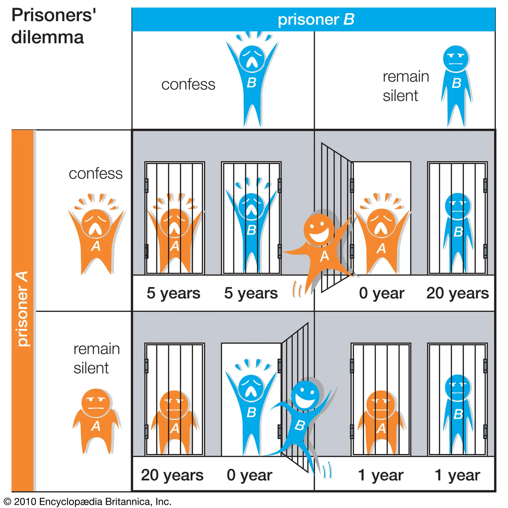
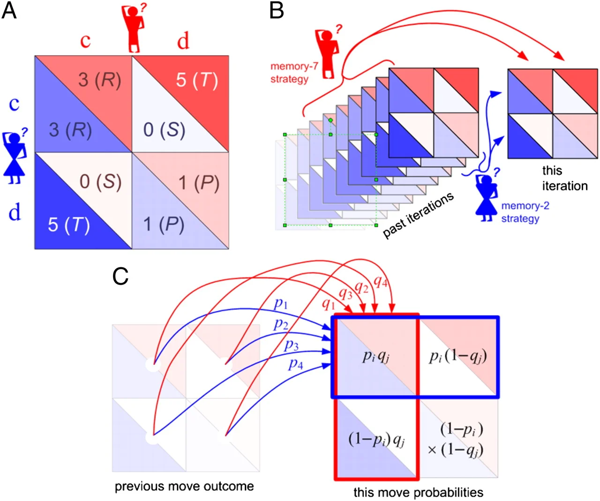

<p align="center">
  
</p>

# Iterated Prisoner's Dilemma - APOGEE'24 & APOGEE'25

This repository contains my approaches for the **Iterated Prisoner's Dilemma (IPD)** challenge at APOGEE, the technical fest of BITS Pilani, including attempts for both **APOGEE'24** and **APOGEE'25**.

## Theory

### The Prisoner's Dilemma



The **Prisoner's Dilemma** is a classic game-theory scenario. Two prisoners are held separately and each must choose to either **cooperate** (stay silent) or **defect** (betray the other). The twist: neither knows what the other will do.

The payoff structure creates a tension:

|                | Other cooperates | Other defects |
|----------------|------------------|---------------|
| **You cooperate** | Both get a moderate reward | You get the worst outcome; other gets the best |
| **You defect**    | You get the best outcome; other gets the worst | Both get a poor outcome |

Individually, defecting always yields a better or equal outcome than cooperating, no matter what the other does. So rational self-interest suggests: *defect*. Yet if both defect, both do worse than if both had cooperated. The dilemma: cooperation is collectively better, but defection is individually rational.

### The Iterated Prisoner's Dilemma



In the **Iterated Prisoner's Dilemma (IPD)**, the same two players face each other repeatedly over many rounds. Each round is a one-shot Prisoner's Dilemma, but now players can use the history of play to inform their choices.

This changes everything. Strategies like **Tit for Tat** (cooperate first, then copy the opponent's last move) can thrive: they reward cooperation and punish defection. Robert Axelrod's famous tournaments in the 1980s showed that simple, nice, forgiving strategies often outperform purely selfish ones when the game is repeated. The possibility of future interaction makes cooperation rational.

## Overview

The APOGEE challenge uses a variant of the classic IPD with:

- **Dynamic payoff matrix:** Payoffs evolve with a cooperation streak (every 5 consecutive coops increase rewards/penalties).
- **Communication noise:** ~1-5% of moves can be misinterpreted (cooperation seen as defection).
- **Streak mechanics:** True defection resets the streak; noise halves it.

## Repository Structure

```
prisonerdilemma/
├── approaches/           # Consolidated strategies (use this)
│   ├── base_agent.py     # Base class for all strategies
│   ├── eval_engine.py    # Unified evaluation engine
│   ├── 01_tit_for_tat.py
│   ├── 02_always_cooperate.py
│   ├── 03_always_defect.py
│   ├── 04_random_80_20.py
│   ├── 05_generous_tit_for_tat.py
│   ├── 06_gtft_streak.py
│   ├── 07_final_strategy.py   # 2nd Prize APOGEE'24
│   ├── 08_pavlov_wsls.py
│   ├── 09_testing_schedule.py
│   ├── 10_streak_based.py
│   └── 11_streak_based_relaxed.py
├── IteratedPrisonersDilemma/  # Original APOGEE'24 submission
├── test_archives/              # Merged test experiments (from Test, Test 2, TestNew)
└── README.md
```

## All Approaches

| # | Strategy | File | Description |
|---|----------|------|-------------|
| 1 | **Tit for Tat** | `01_tit_for_tat.py` | Cooperate first, then copy opponent's last move. Classic Axelrod winner. |
| 2 | **Always Cooperate** | `02_always_cooperate.py` | Always cooperate. Baseline; exploitable. |
| 3 | **Always Defect** | `03_always_defect.py` | Always defect. Maximizes short-term gain vs cooperators. |
| 4 | **Random 80-20** | `04_random_80_20.py` | 80% cooperate, 20% defect. For testing vs unpredictable opponents. |
| 5 | **Generous Tit for Tat** | `05_generous_tit_for_tat.py` | Tit for Tat with forgiveness when exploited (~25% chance to cooperate after opponent defects). |
| 6 | **GTFT with Streak** | `06_gtft_streak.py` | Generous TFT adapted for dynamic payoff & noise; accounts for cooperation streak. |
| 7 | **Final Strategy** | `07_final_strategy.py` | Generosity with exponential decay based on streak. *(2nd Prize APOGEE'24, by another participant; included for reference.)* |
| 8 | **Pavlov / WSLS** | `08_pavlov_wsls.py` | Win-Stay-Lose-Shift: cooperate if last round was good, defect if bad. |
| 9 | **Testing Schedule** | `09_testing_schedule.py` | Probe with C,D,C,C; if opponent always cooperated, defect forever; else Tit for Tat. |
| 10 | **Streak-Based** | `10_streak_based.py` | Tracks defect/coop streaks; forgives after long defect streaks or coop streaks. |
| 11 | **Streak-Based (Relaxed)** | `11_streak_based_relaxed.py` | Same as Streak-Based with lower thresholds (3 instead of 5). |

## How to Run

### Option A: `approaches/` (recommended)

All strategies live as separate files. Pick two, plug them into the eval engine, and run.

**Step 1.** Open `approaches/eval_engine.py` and set `player1` and `player2` (around lines 29-32):

```python
from importlib import import_module

_tft = import_module("01_tit_for_tat")
_fs = import_module("07_final_strategy")
player1 = _tft.TitForTat(1)
player2 = _fs.FinalStrategy(2)
```

Change the module names and class names to use any two strategies (e.g. `02_always_cooperate` / `AlwaysCooperate`, `08_pavlov_wsls` / `PavlovWSLS`).

**Step 2.** Run the eval engine:

```bash
cd approaches
python3 eval_engine.py
```

The output is a JSON log of each round and the final scores.

### Option B: `test_archives/` or `IteratedPrisonersDilemma/`

Here you swap in different strategy files as `p1` and `p2` (or `player1` and `player2`), then run the eval.

**Step 1.** Choose which strategies play. In `test_archives/`, edit `p1.py` and `p2.py` (or replace them with `p3.py`, `bestagent.py`, etc.). In `IteratedPrisonersDilemma/`, edit `player1.py` and `player2.py`.

**Step 2.** Update the eval engine imports to match. For example, in `test_archives/eval_engine.py`:

```python
import p1, p2   # or: import p1, bestagent
player1 = p1.p1(1)
player2 = p2.p2(2)   # or: player2 = bestagent.Agent(2)
```

**Step 3.** Run:

```bash
cd test_archives   # or: cd IteratedPrisonersDilemma
python3 eval_engine.py
```

## Move Encoding

- `1` = Cooperate  
- `-1` = Defect  

## Results

- **APOGEE'24 (IEEE Event):** The **Final Strategy** (`07_final_strategy.py`) won 2nd Prize. That approach was by another participant; included here for reference.
- **APOGEE'25:** Various strategies tested; streak-based and generous variants performed well in noisy environments.

## Original Folders

- **IteratedPrisonersDilemma/:** Main APOGEE'24 submission (GTFT, final_strategy, player1/2).
- **test_archives/:** Merged test experiments (from Test, Test 2, TestNew). Early experiments including TFT, GTFT, WSLS, testing schedule, streak-based variants.

## References

- Axelrod, R. (1984). *The Evolution of Cooperation.*
- Problem inspired by Robert Axelrod's Strategy Comparison Games.
- [The Iterated Prisoner's Dilemma and The Evolution of Cooperation](https://www.youtube.com/watch?v=BOvAbjfJ0x0) - This Place
- [How to outsmart the Prisoner's Dilemma](https://www.youtube.com/watch?v=emyi4z-O0ls) - TED-Ed
- [This game theory problem will change the way you see the world](https://www.youtube.com/watch?v=mScpHTIi-kM) - Veritasium - really nice vid, had watched this even before i ever got to know about this challenge
